# GM-100 MVP1 Joint Flow Experiment Report

- Machine: 5060 (`dayu@192.168.137.49`)
- Latest report/code commit on local and 5060: `f713046`
- Data: GM-100 50x5 light split, frozen DINOv2 visual features, frozen SigLIP prompt features
- Output root on 5060: `outputs/gm100_mvp1_joint_flow`
- Seeds: `42, 43, 44`

## Architecture / Config

MVP1 uses a lightweight typed-token DiT-style Transformer denoiser.

Condition tokens:

```text
prompt embedding + history observation latents + proprio history
```

Noisy or clamped flow tokens:

```text
future observation latents + future action chunk + DeltaPhi token
```

Model config:

- `history=4`, `horizon=8`, `stride=2`
- `feature_dim=768`, `prompt_dim=768`, `action_dim=14`, `proprio_dim=14`
- `hidden_dim=192`, `transformer_layers=3`, `transformer_heads=4`
- modality embedding + temporal embedding + mask/clamp embedding
- AdaLN-style Transformer blocks with flow timestep conditioning
- modality-specific velocity heads for future obs latent, action, and `DeltaPhi`

Trainable modules:

- all joint-flow projections, embeddings, Transformer attention/MLP blocks, AdaLN timestep MLP, velocity heads

Frozen modules/data and excluded inputs:

- DINOv2 feature extractor, SigLIP text encoder, prompt feature table
- numeric `task_id` and `stage_id` are not used as model embeddings or input tokens

Loss:

```text
L =
  1.0  * MSE(v_obs, v_obs_target)
+ 1.0  * MSE(v_action, v_action_target)
+ 10.0 * MSE(v_phi, v_phi_target)
+ 0.1  * L_cf
```

where `L_cf = -logsigmoid(phi_pos - phi_neg - 0.03)`.

## Results

| seed | DeltaPhi MAE | DeltaPhi RMSE | all-neg ranking | all-neg margin |
| ---: | ---: | ---: | ---: | ---: |
| 42 | 0.0157 | 0.0318 | 0.5803 | 0.0008 |
| 43 | 0.0203 | 0.0354 | 0.5086 | 0.0001 |
| 44 | 0.0206 | 0.0345 | 0.6140 | 0.0018 |
| mean+/-std | 0.0189+/-0.0027 | 0.0339+/-0.0019 | 0.5676+/-0.0538 | 0.0009+/-0.0009 |

Per-negative ranking:

| negative | ranking | margin |
| --- | ---: | ---: |
| zero | 0.6439+/-0.1177 | 0.0024+/-0.0021 |
| reverse | 0.5016+/-0.0097 | 0.0000+/-0.0000 |
| shuffle | 0.5027+/-0.0009 | 0.0000+/-0.0001 |
| wrong_arm | 0.5434+/-0.1086 | 0.0009+/-0.0017 |
| scaled_0.25 | 0.6439+/-0.1161 | 0.0018+/-0.0016 |
| scaled_1.75 | 0.5703+/-0.0776 | 0.0004+/-0.0005 |

Flow reconstruction metrics:

| metric | mean+/-std |
| --- | ---: |
| obs_flow_mse | 1.3187+/-0.0177 |
| action_flow_mse | 0.4679+/-0.0522 |
| phi_flow_mse | 0.0656+/-0.0372 |
| future_obs_y0_mse | 0.4297+/-0.0110 |
| action_y0_mse | 0.0887+/-0.0091 |

## Comparison To MVP0

| model | DeltaPhi MAE | DeltaPhi RMSE | all-neg ranking | all-neg margin |
| --- | ---: | ---: | ---: | ---: |
| MVP0 `stage_action_cf` | 0.0223+/-0.0043 | 0.0360+/-0.0006 | 0.8196+/-0.0272 | 0.0162+/-0.0025 |
| MVP0 `prompt_cf_w10` | 0.0125+/-0.0006 | 0.0330+/-0.0003 | 0.7512+/-0.0215 | 0.0066+/-0.0001 |
| MVP0 `prompt_cf_w20` | 0.0121+/-0.0008 | 0.0321+/-0.0019 | 0.7243+/-0.0226 | 0.0056+/-0.0006 |
| MVP1 joint flow | 0.0189+/-0.0027 | 0.0339+/-0.0019 | 0.5676+/-0.0538 | 0.0009+/-0.0009 |

Comparison figures:

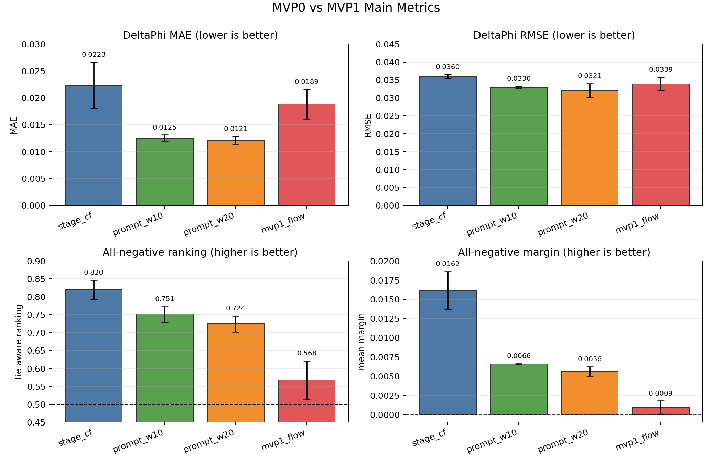

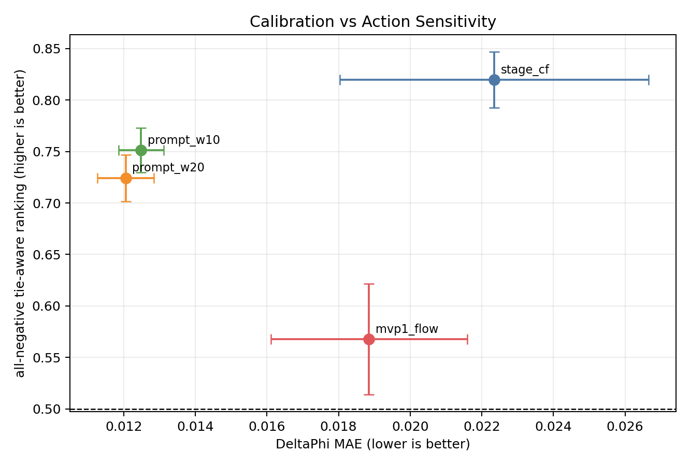

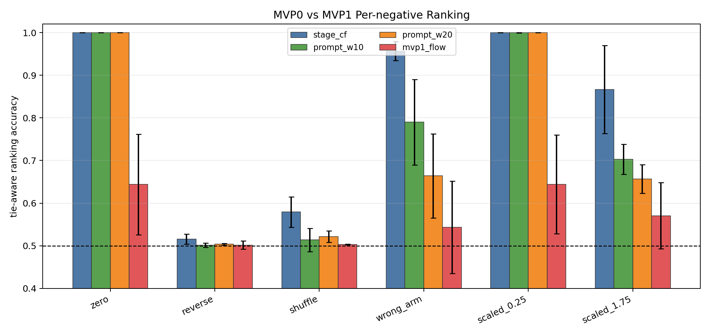

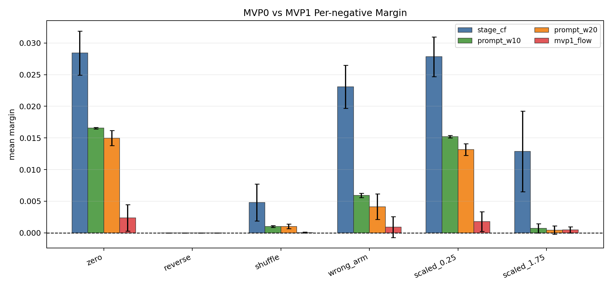

## MVP1 V2 Improvement

V2 keeps the same lightweight DiT backbone but changes the training and scoring objective:

- `phi_tokens=8`: scalar `DeltaPhi` becomes a primitive-local cumulative DeltaPhi trajectory.
- `score.denoise_steps=4`: critic scoring uses short Euler denoising instead of single-step `tau=0`.
- `critic_flow_weight=1.0`: every batch includes an explicit action-clamped critic-flow auxiliary loss.
- `counterfactual_weight=0.5`: CF ranking supervision is stronger than V1.
- `cf_negatives_per_batch=3`: each train batch samples multiple negative action types.
- checkpoint selection changes from `val/delta_phi_mae` to `val/all_negatives_tie_aware_ranking_acc`.

V2 results:

| seed | DeltaPhi MAE | DeltaPhi RMSE | all-neg ranking | all-neg margin |
| ---: | ---: | ---: | ---: | ---: |
| 42 | 0.0155 | 0.0336 | 0.7022 | 0.0044 |
| 43 | 0.0120 | 0.0288 | 0.6602 | 0.0025 |
| 44 | 0.0200 | 0.0324 | 0.7018 | 0.0084 |
| mean+/-std | 0.0158+/-0.0040 | 0.0316+/-0.0025 | 0.6881+/-0.0241 | 0.0051+/-0.0030 |

V2 vs V1 and MVP0:

| model | DeltaPhi MAE | DeltaPhi RMSE | all-neg ranking | all-neg margin |
| --- | ---: | ---: | ---: | ---: |
| MVP0 `stage_action_cf` | 0.0223+/-0.0043 | 0.0360+/-0.0006 | 0.8196+/-0.0272 | 0.0162+/-0.0025 |
| MVP0 `prompt_cf_w10` | 0.0125+/-0.0006 | 0.0330+/-0.0003 | 0.7512+/-0.0215 | 0.0066+/-0.0001 |
| MVP0 `prompt_cf_w20` | 0.0121+/-0.0008 | 0.0321+/-0.0019 | 0.7243+/-0.0226 | 0.0056+/-0.0006 |
| MVP1 V1 | 0.0189+/-0.0027 | 0.0339+/-0.0019 | 0.5676+/-0.0538 | 0.0009+/-0.0009 |
| MVP1 V2 | 0.0158+/-0.0040 | 0.0316+/-0.0025 | 0.6881+/-0.0241 | 0.0051+/-0.0030 |

V2 improves MVP1 ranking by `+0.1205` absolute and improves mean margin by about `5.6x`. It also improves RMSE relative to V1. It still trails the strongest MVP0 CF baselines in ranking, but the gap to `prompt_cf_w20` narrows from `0.1567` to `0.0362`.

Because the current primitive potential ground truth is linearly interpolated over primitive time, the negative types should be interpreted in two groups:

| metric group | negative types | V1 ranking | V2 ranking | V1 margin | V2 margin |
| --- | --- | ---: | ---: | ---: | ---: |
| coarse action CF | `zero`, `wrong_arm`, `scaled_0.25`, `scaled_1.75` | 0.6004 | 0.7816 | 0.0014 | 0.0076 |
| temporal diagnostic | `reverse`, `shuffle` | 0.5021 | 0.5011 | 0.0000 | 0.0001 |

The coarse CF group is the more semantically reliable metric under the current labels: these negatives change action magnitude, arm identity, or gross feasibility. The temporal diagnostic group is useful for debugging, but current time-interpolated labels do not provide strong causal supervision that `reverse` or `shuffle` should lower primitive progress.

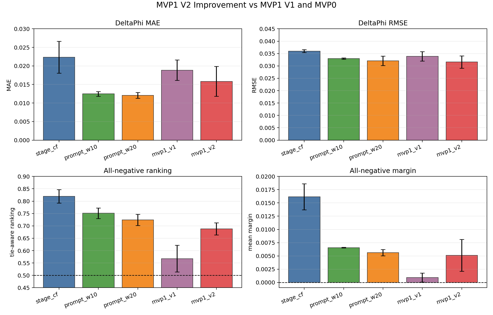

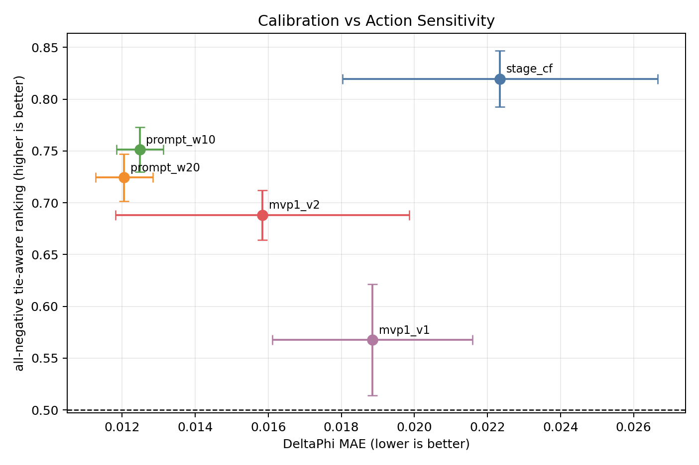

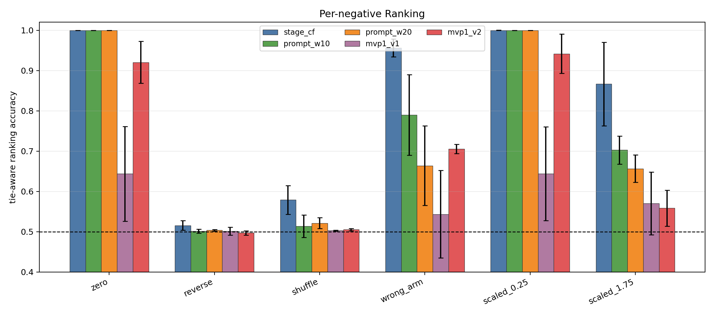

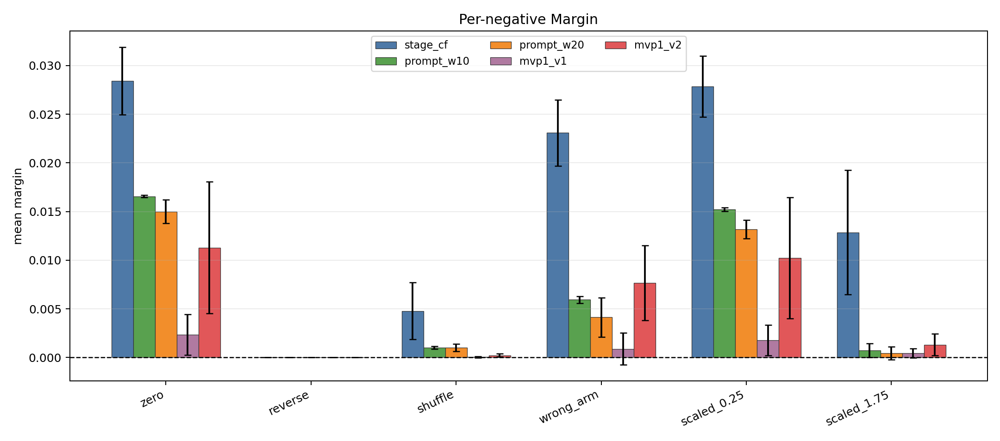

`reverse` and `shuffle` remain near random. Under the current linear-time potential labels, this should be treated as a limitation of the supervision / diagnostic setup rather than a primary model failure.

## MVP1.5 Ablation And Sweep Update

MVP1.5 keeps the V2 architecture and separates the label-faithful coarse action CF metric from temporal diagnostics. The full report is in `docs/gm100_mvp1_5_report.md`.

Main result:

| model | seeds | DeltaPhi MAE | DeltaPhi RMSE | coarse ranking | all-neg ranking |
| --- | ---: | ---: | ---: | ---: | ---: |
| MVP1 V1 | 3 | 0.0189+/-0.0027 | 0.0339+/-0.0019 | 0.6004+/-0.0813 | 0.5676+/-0.0538 |
| MVP1 V2 | 3 | 0.0158+/-0.0040 | 0.0316+/-0.0025 | 0.7816+/-0.0369 | 0.6881+/-0.0241 |
| MVP1 V3 coarse-selected | 3 | 0.0158+/-0.0040 | 0.0316+/-0.0025 | 0.7816+/-0.0369 | 0.6881+/-0.0241 |

V3 changes checkpoint selection from all-negative ranking to coarse action CF ranking, but it reproduces the same aggregate as V2. Therefore V3 is a selection-policy check, not a new model improvement.

Seed-42 ablation:

| run | DeltaPhi MAE | coarse ranking | all-neg ranking | interpretation |
| --- | ---: | ---: | ---: | --- |
| `phi_traj_only` | 0.0476 | 0.7515 | 0.6678 | trajectory helps ranking but hurts calibration |
| `critic_aux_only` | 0.0737 | 0.6513 | 0.6022 | critic auxiliary alone is insufficient |
| `cf_multi_only` | 0.0816 | 0.8437 | 0.7272 | strong CF becomes discriminative but poorly calibrated |
| `v2_full` | 0.0155 | 0.8050 | 0.7022 | best balanced seed-42 ablation baseline |

Seed-42 sweep:

| run | DeltaPhi MAE | coarse ranking | all-neg ranking | interpretation |
| --- | ---: | ---: | ---: | --- |
| `cf_1p0` | 0.0193 | 0.9083 | 0.7931 | strongest action-sensitivity pilot, needs three-seed confirmation |
| `phi_w20` | 0.0130 | 0.7645 | 0.6715 | improves calibration but weakens ranking |
| `critic_w2` | 0.0134 | 0.7798 | 0.6870 | no ranking gain over V2/V3 |
| `steps_8` | 0.0155 | 0.8026 | 0.7008 | no meaningful gain over 4-step scoring |

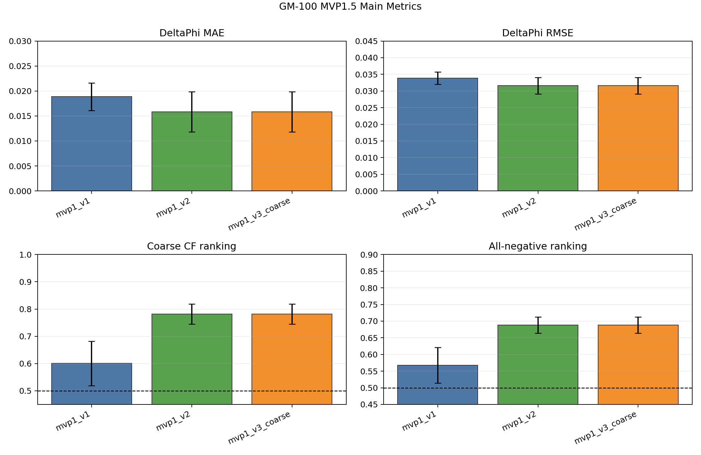

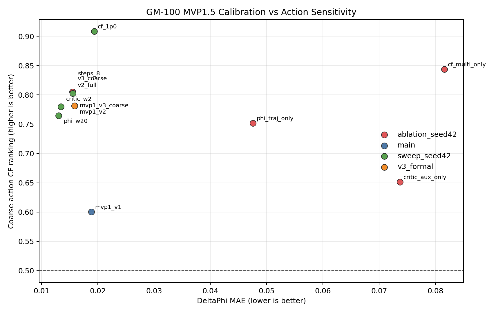

MVP1.5 conclusion: the best next candidate is `cf_1p0` as a three-seed run, optionally paired with a calibration-preserving variant such as `cf_1p0 + phi_weight=20` or checkpointing with an MAE constraint. V2 remains the balanced MVP1 baseline until `cf_1p0` is validated across seeds.

## Interpretation

MVP1 closes the engineering loop: prompt-conditioned latent/action/potential joint flow trains, evaluates, scores counterfactual actions, writes checkpoints, writes metrics, and generates figures on 5060.

Scientifically, V1 was not yet stronger than MVP0. V2 is a meaningful improvement and nearly reaches `prompt_cf_w20` on all-negative ranking, but it still does not beat the strongest MVP0 CF baselines. Under the more label-faithful coarse CF group, V2 reaches `0.7816` ranking and `0.0076` margin, which is the strongest evidence so far that the joint-flow critic is learning action-conditioned potential.

The V1 bottleneck was critic-mode mismatch: evaluation clamped candidate action at `tau=0` while future obs and `DeltaPhi` started from zeros, but training mostly learned scalar `DeltaPhi` flow and not a robust masked critic trajectory. V2 reduces this mismatch with trajectory `phi`, explicit critic-flow loss, stronger CF loss, and multi-step scoring.

Next changes should focus on:

- report coarse CF and temporal diagnostic metrics separately;
- tune the V2 tradeoff between `prompt_cf_w20`-level calibration and ranking;
- improve potential labels if temporal-order sensitivity becomes a real objective, for example with contact events, object-state distance, subgoal distance, or future-latent consistency;
- keep future obs/action/potential masked-modality training, but make critic mode a first-class training objective.

## Figures / Artifacts

Tracked summary figures:

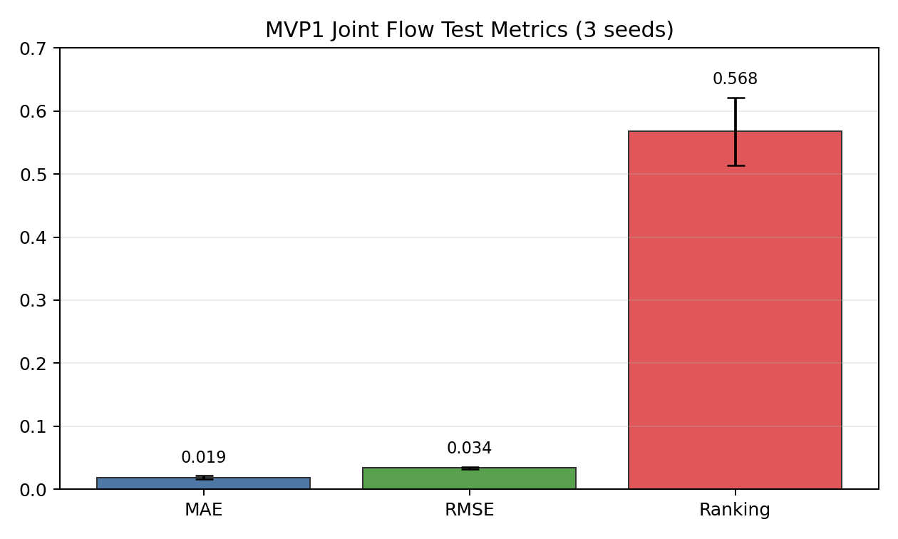

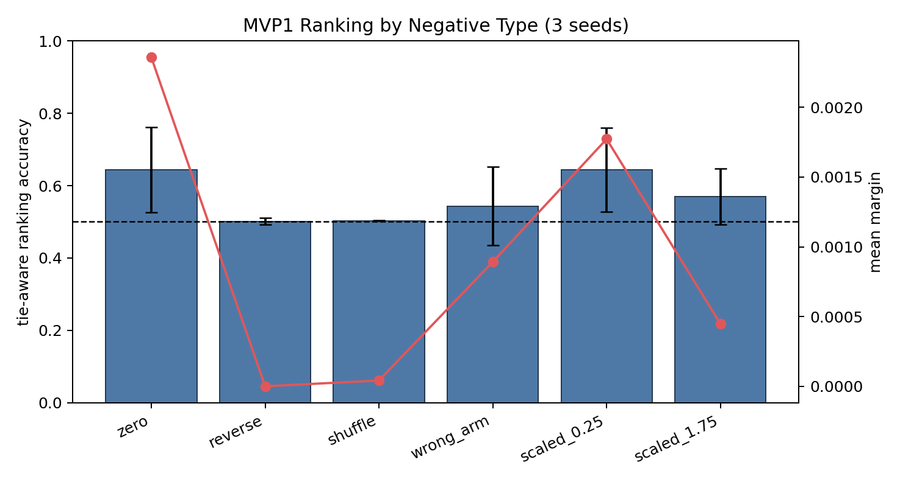

Representative seed 42 figures:

- `docs/figures/gm100_mvp1_joint_flow/seed_42/delta_phi_scatter.png`
- `docs/figures/gm100_mvp1_joint_flow/seed_42/per_negative_ranking.png`
- `docs/figures/gm100_mvp1_joint_flow/seed_42/training_curves.png`

5060 output artifacts:

- `outputs/gm100_mvp1_joint_flow/seed_42/mvp1_joint_flow`
- `outputs/gm100_mvp1_joint_flow/seed_43/mvp1_joint_flow`
- `outputs/gm100_mvp1_joint_flow/seed_44/mvp1_joint_flow`
- `outputs/gm100_mvp1_joint_flow/aggregate/metrics_by_seed.csv`
- `outputs/gm100_mvp1_joint_flow/aggregate/aggregate_metrics.json`
- `outputs/gm100_mvp1_joint_flow/aggregate/figures`
- `outputs/gm100_mvp1_joint_flow_v2/seed_42/mvp1_joint_flow`
- `outputs/gm100_mvp1_joint_flow_v2/seed_43/mvp1_joint_flow`
- `outputs/gm100_mvp1_joint_flow_v2/seed_44/mvp1_joint_flow`
- `outputs/gm100_mvp1_joint_flow_v2/aggregate/metrics_by_seed.csv`
- `outputs/gm100_mvp1_joint_flow_v2/aggregate/aggregate_metrics.json`
- `outputs/gm100_mvp1_joint_flow_v2/aggregate/figures`
- `outputs/gm100_mvp1_joint_flow_v3_coarse/seed_42/mvp1_joint_flow`
- `outputs/gm100_mvp1_joint_flow_v3_coarse/seed_43/mvp1_joint_flow`
- `outputs/gm100_mvp1_joint_flow_v3_coarse/seed_44/mvp1_joint_flow`
- `outputs/gm100_mvp1_5_ablation/*/seed_42`
- `outputs/gm100_mvp1_5_sweep/*/seed_42`

Tracked summary data:

- `docs/figures/gm100_mvp1_joint_flow/metrics_by_seed.csv`
- `docs/figures/gm100_mvp1_joint_flow/aggregate_metrics.json`
- `docs/figures/gm100_mvp1_joint_flow_v2/metrics_by_seed.csv`
- `docs/figures/gm100_mvp1_joint_flow_v2/aggregate_metrics.json`
- `docs/figures/gm100_mvp0_mvp1_comparison/mvp0_mvp1_comparison_metrics.csv`
- `docs/figures/gm100_mvp0_mvp1_comparison/mvp0_mvp1_comparison_metrics.json`
- `docs/figures/gm100_mvp1_v2_comparison/mvp1_v2_comparison_metrics.csv`
- `docs/figures/gm100_mvp1_v2_comparison/mvp1_v2_comparison_metrics.json`
- `docs/gm100_mvp1_5_report.md`
- `docs/figures/gm100_mvp1_5/metrics_by_run.csv`
- `docs/figures/gm100_mvp1_5/aggregate_metrics.csv`
- `docs/figures/gm100_mvp1_5/mvp1_5_main_metrics.png`
- `docs/figures/gm100_mvp1_5/ablation_coarse_ranking.png`
- `docs/figures/gm100_mvp1_5/sweep_coarse_ranking.png`
- `docs/figures/gm100_mvp1_5/calibration_vs_coarse_ranking.png`

## Verification

- 5060 targeted test: `tests/test_joint_flow.py` -> `4 passed`
- 5060 full test suite: `93 passed, 12 warnings`
- 5060 smoke run: `outputs/gm100_mvp1_joint_flow_smoke/seed_42/mvp1_joint_flow`
- 5060 formal runs: seeds `42`, `43`, `44`
- 5060 V2 targeted test: `tests/test_joint_flow.py` -> `7 passed`
- 5060 V2 full test suite: `96 passed, 12 warnings`
- 5060 V2 smoke run: `outputs/gm100_mvp1_joint_flow_v2_smoke/seed_42/mvp1_joint_flow`
- 5060 V2 formal runs: seeds `42`, `43`, `44`
- 5060 MVP1.5 targeted test: `tests/test_joint_flow.py` -> `7 passed`
- 5060 MVP1.5 full test suite: `96 passed, 12 warnings`
- 5060 MVP1.5 V3 smoke run: `outputs/gm100_mvp1_joint_flow_v3_coarse_smoke/seed_42/mvp1_joint_flow`
- 5060 MVP1.5 V3 formal runs: seeds `42`, `43`, `44`
- 5060 MVP1.5 seed-42 ablation runs: `phi_traj_only`, `critic_aux_only`, `cf_multi_only`, plus reused `v2_full` and `v3_coarse`
- 5060 MVP1.5 seed-42 sweep runs: `cf_1p0`, `phi_w20`, `critic_w2`, `steps_8`
- PNG figures were copied locally and inspected for nonblank rendering.
